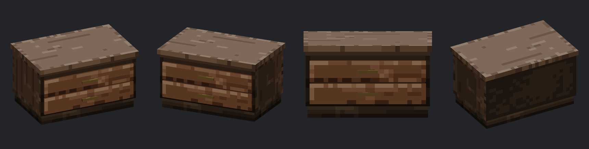

# Мебель для сервера: ресурспак Minecraft Java 1.16.5

Модели в формате **Java Block/Item** (JSON-модель с элементами и PNG-текстура), `pack_format: 6` для версий 1.16.2–1.16.5.
Внешний вид основан на ресурспаке `мебель-и-декор` и на мебели с сервера DayZ «Карусель PVE». Модели сделаны заново, а не скопированы.

| Модель | Файл | CustomModelData | Статус |
|---|---|---|---|
| Деревянный комод | `furn_dresser_wood` | 9201 | ✅ готов |
| Большой шкаф | — | 9202 | ожидает |
| Холодильник среднего размера | — | 9203 | ожидает |
| Старый шкаф | — | 9204 | ожидает |
| Шкаф | — | 9205 | ожидает |
| Армейский деревянный ящик | — | 9206 | ожидает |
| Большой армейский ящик | — | 9207 | ожидает |
| Маленький армейский ящик | — | 9208 | ожидает |



## Что внутри

```
resourcepack/
  pack.mcmeta                                     pack_format 6 (1.16.5)
  pack.png
  assets/minecraft/models/item/paper.json         overrides по custom_model_data
  assets/zona_item/models/item/<model>.json       модель (Java Block/Item)
  assets/zona_item/textures/item/<model>.png      текстура 64x64
dist/zona_furniture_1.16.5.zip                    готовый к установке пак
previews/                                         рендеры (иконка в слоте, ракурсы)
generator/                                        исходник генератора моделей и текстур
```

Namespace `zona_item` и путь `item/...` такие же, как в исходном паке. Файлы можно просто скопировать к себе в пак.
Если у вас уже есть `assets/minecraft/models/item/paper.json`, перенесите строки из `overrides` в свой файл.
Записи должны идти по возрастанию `custom_model_data`.

## Проверка в игре (1.16.5)

```
/give @p minecraft:paper{CustomModelData:9201}
```

Модель стоит в масштабе 1:1 (16 единиц = 1 блок), передняя сторона смотрит на север.
Настроены два способа поставить мебель в мир:

* **голова стойки для брони** (`display.head`: translation `0 -30.43 0`, scale `1.6`). Низ модели на уровне ног стойки, фасад смотрит туда же, куда стойка:
  ```
  /summon armor_stand ~ ~ ~ {Invisible:1b,NoGravity:1b,Marker:1b,ArmorItems:[{},{},{},{id:"minecraft:paper",Count:1b,tag:{CustomModelData:9201}}]}
  ```
* **невидимая рамка на полу** (`display.fixed`: rotation `-90 0 0`, translation `0 0 -16`, scale `2`), как это делают Oraxen и похожие плагины:
  ```
  /summon item_frame ~ ~ ~ {Facing:1b,Invisible:1b,Fixed:1b,Item:{id:"minecraft:paper",Count:1b,tag:{CustomModelData:9201}}}
  ```

Если ваш плагин ставит мебель по-другому, достаточно поправить блок `display` в JSON (в Blockbench это вкладка Display).
Сама геометрия от этого не меняется.

Режимы `gui`, `ground` и `firstperson/thirdperson` подобраны так, чтобы предмет целиком помещался в слот и нормально выглядел в руке.

## Редактирование в Blockbench

`File → Open Model` → `resourcepack/assets/zona_item/models/item/furn_dresser_wood.json`. Проект откроется в формате **Java Block/Item**, текстура подхватится из папки `assets` автоматически.
Модель проходит ограничения 1.16.5: координаты в пределах −16…32, повороты только по одной оси и только на 0/±22.5/±45°.

## Пересборка

```
cd generator
pip install pillow numpy
python3 build.py                      # все модели
python3 build.py furn_dresser_wood    # одна модель
```

Скрипт генерирует JSON и текстуры, проверяет их на ограничения 1.16.5, рендерит превью и собирает zip.
